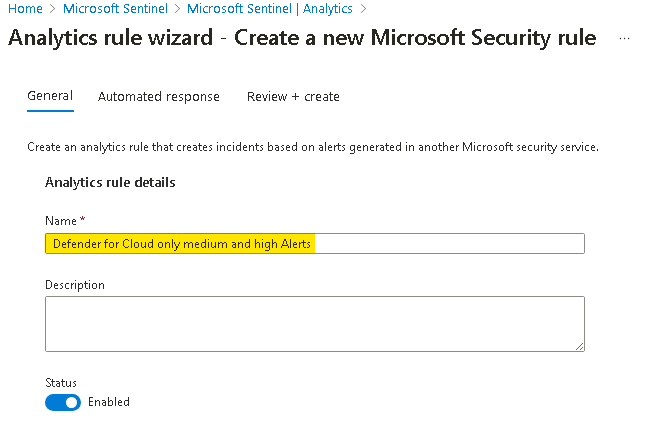
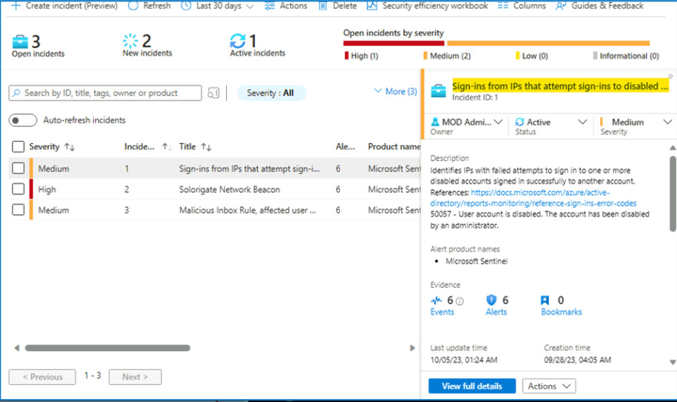
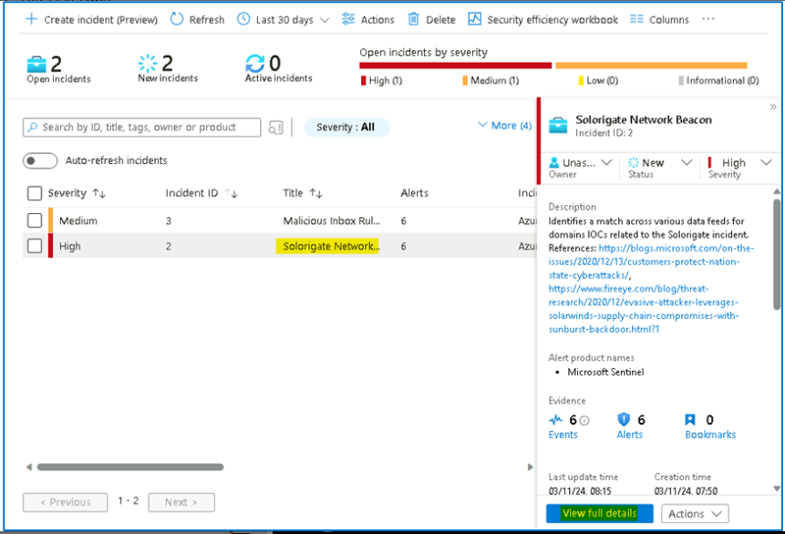
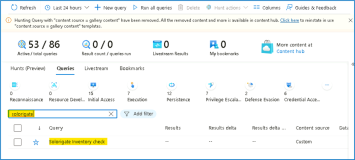

# Lab 3 – Analytics Rules

## Objectives

This Lab guides you through the Analytics Rule part in Microsoft
Sentinel, and shows you how to create different type of rules (Security
Detections).

## Prerequisites

This Lab assumes that ***you have completed Lab 1***, as the data and
the artifacts that we will be using in this Lab need to be deployed on
your Microsoft Sentinel instance.

## Task 1: Analytics Rules overview

1.  In the browser tab navigate to the Azure Portal
    [**http://portal.azure.com**](http://portal.azure.com) and search
    for **Microsoft Sentinel** and click on **Microsoft Sentinel**.

1.  Select **MicrosoftSentinelWorkspace**.

    

2.  On the left menu navigate to **Analytics** and select **Rule
    template** section

3.  Click on Rule templates tab and review the default analytics rules
    templates, then click on **Add filter** then select **Data
    Sources**.

4.  Check **Security Events via Legacy Agents**, select **Apply**. Now
    review all the analytic rules on the above data source.

5.  In the rule search bar type **Anomalous RDP Login** for the rule
    name. Select the rule and open the side panel.

6.  To review the rule logic and possible configuration options, in the
    right lower corner press **Create rule**.

    **Note** - If the Create rule button does not appear, ensure the
    panel is enabled from the right side of the screen.

7.  Review the rule definition like tactics and severity. Press **Next:
    Automated response** in the bottom of the page.

8.  On the Automated response tab, click on **+ Add new** to create new
    Automation rule by referring to the image shown below.

9.  After you reviewed the rule configuration options, close this page
    and navigate back to the main **Microsoft Sentinel Overview**
    screen. Continue to the next exercise.

## Task 2: Creating Microsoft Sentinel custom analytics rule

Microsoft Sentinel is a cloud-native SIEM and as such, it acts as single
pane of glass for alerts and event correlation. For this purpose, and to
be able to ingest and surface alerts from Microsoft Security Products,
we create a **Microsoft incident creation rule**. In this exercise, we
will review this feature and create one example rule with a filtering
option to help the analyst deal with alert fatigue.

1.  While still on the **Microsoft Sentinel** under the
    **Analytics** section click on **+Create** and select **Microsoft
    incident creation rule**.

10. In the rule name enter "**Defender for Cloud only medium and high
    Alerts**".

    

11. In the Microsoft security service dropdown select **Microsoft**
    **Defender for Cloud**.

12. In the **Filter by severity** select custom and select the
    checkboxes for **High** and **Medium**.

13. Click on **Next: Automated response**.

14. In the above **"Automated response"** page you can attach automation
    rule that can generate automation tasks that can assist your SOC
    with repetitive tasks, or Security remediation. Click on **Next:
    Review + create**.

15. On the Review + create page, click on the Save button.

16. Stay on the **Analytics** page and continue to the next
    **Exercise**.

    

## Task 3: Reviewing Microsoft Sentinel incident tools and capabilities.

Fusion rule is a unique kind of detection rule. With Fusion rule,
Microsoft Sentinel can automatically detect multistage attacks by
identifying combinations of anomalous behaviours and suspicious
activities That are observed at various stages of the kill-chain.

In this exercise, we will learn how to distinguish and review **Fusion
rule** in Microsoft Sentinel.

1.  In the analytics page on **Rule templates** tab, click **Add
    filter** and select **Rule Type**

    

2.  Select the check box for **Fusion** and then click on **Apply**.

17. In the template screen notice the status as Enabled as this rule
    template enabled by default.

18. From the detail panel, review the details for the **Advanced
    Multistage Attack Detection** rule . Stay on the same page for next
    exercise.

As Fusion rules produce security incidents with high fidelity and
simulation can be challenging, we are adding an example of an incident
that was created from fusion detection.

In the next example we will see 2 low severity alerts from **Microsoft
Entra Identity Protection** and **Microsoft Cloud App Security** that
stich together into high severity incidence:

## Task 4: Create Microsoft Sentinel custom analytics rule

1.  In the left menu click on the **Logs** close the pop-up and navigate
    to the search **Canvas**.

**Note**: in this lab we are using custom logs that replace the
Out-off-the-box tables.

19. To check if this operations are being captured as part of your
    collection strategy, run the search query below to see the list of
    activities Microsoft Sentinel captured in the last 24hr

> **OfficeActivity_CL | distinct Operation_s**

20. You will be able to see the **New-InboxRule** operation is indeed
    captured in your logs.

21. Navigate to the **Analytics** from the navigation bar. In the top
    bar click on **+Create** and select **scheduled query Rule**.

22. On the **Analytics rule wizard - Create a new Scheduled rule** page,
    provide the below details.

    - In the Name type "**Malicious Inbox Rule - custom**".

    - In the rule **Description** enter **This rule is detecting on
      delete all traces of phishing email from user mailboxes.**

    - In the **Tactics and techniques**
      select **Persistence **and** Defence Evasion**.

    - In the rule **Severity** select **medium**.

    - Click **Next: SET rule logic\>**.

23. In the **Rule logic** page, review and copy the query from the file
    **Lab3_analytics_rule_query.txt** given in **C:\Labfiles\\**

24. We can view the rule creation estimating by pressing **Test with
    current data** in the right side.

25. You will be able to see the number of hits.

26. Under the **Alert enrichment** expand the **Entity mapping** section
    that will allow us to map our fields to well-known categories:

- In the **Entity type** open the supported list of entities and
  select **Account**.

  

- From the **Identifier** dropdown menu select **FullName** and from
  **Value** drop down menu select **UserId\_\_s.**

  

- Click **+ Add new entity** and this time select **Host** entity. From
  **Identifier** dropdown menu select **FullName** and from **Value**
  dropdown menu select **OriginatingServer_s**

- Click**+ Add new entity**, select **IP** from **Entity type** dropdown
  menu, in the **Identifier** select **Address** and for **Value**
  select **ClientIPAddress** value.

27. Expand the **Alert details** feature and create custom **Alert Name
    Format.**

- In the **Alert Name Format** enter the dynamic title **"Malicious
  Inbox Rule, affected user {{UserId\_\_s}}"**

28. Scroll down and in the **Query scheduling** set the **run query
    every** to **5 minutes** and the **Lookup data to last 12
    Hours** (This scheduling might not be ideal for production
    environment and should be tune). If you deployed the lab more than
    12 hours ago, you will need to change the lookback period.

    

29. In the **Suppression** leave it to **Off**. Click
    the **Next:Incident settings**\>.

30. To reduce the number of alerts, **implement Alert
    grouping** feature. To do so, follow the steps below:

- In the **Incident settings** under **Alert grouping** change it
  to **Enabled**.

- Modify the **Limit the group to alerts created within the selected
  time frame** to **12 hours**.

- Select the **Grouping alerts into a single incident if the selected
  entity types and details matches** and select the **Account** and
  Alert detail as **Name**.

31. Click on **Next: Automated response** and also
    press **Next:Review** and **Create** this newly analytics rule.

    

32. On the **Review + create** tab, review the details and then click on
    **Save** button.

## Task 5: Review resulting security incident

After we created the custom analytics rule that detect us for malicious
inbox rule rules. Let's review the incident that was created from this
analytics rule.

1.  On the main **Microsoft Sentinel** main page,
    select **incidents** and review the incident page. If you do not see
    any incidents. Set the time span for **Last 30 days** from the top
    bar.

33. Locate a new incident with title **"Malicious Inbox Rule, affected
    user <AdeleV@contoso.OnMicrosoft.com>"** notice that the name adapt
    and the effected user name added to the incident name.

34. In the right pane we can review the incident preview, this view will
    gave us high level overview on the incident and the entity that
    related to it.

35. Click on the "**view full details**".

36. In the incident full details page you are able to see **Incident
    timeline** (effective when you have more than one alert in a given
    incident).

37. Click on the Entities tab to review the names of the Entities
    associated with the incident.

38. Click on the entity **"<AdeleV@contoso.OnMicrosoft.com>"** and then
    click on **View full details** button.

39. This action will navigate us to the user entity page, this page will
    give us holistic view on the user entity, with all its activity and
    related alerts. Ensure to select the time to be more than **Last 14
    Days**.

## Task 6 - Handling Incident "Sign-ins from IPs that attempt sign-ins to disabled accounts."

1.  On the Azure
    Portal [**http://portal.azure.com**](urn:gd:lg:a:send-vm-keys),
    search for [**Microsoft Sentinel**](urn:gd:lg:a:send-vm-keys), then
    click on **Microsoft Sentinel**.

2.  Select **SwrkXXXXXXX**.

3.  On the left menu navigate to Incident page and select the **Sign-ins
    from IPs that attempt sign-ins to disabled accounts** incident and
    on the right pane you can see the incident preview with the high
    level information about the incident.

4.  Click on the **View full details** button.

5.  On the **Incident** page, select the number of **Alerts**.

6.  You can see the raw logs showing all the events as the result of the
    query.

7.  In raw log search, expand the **ExtendedProperties**, these
    properties will help us to decide if this incident is correlated to
    other events.

8.  Navigate back to the Incident page by clicking **Done**.

9.  In the **Overview** tab, under **Incident Timeline**, select **3
    dots** near the latest alert and select **Run Playbook**.

10. Click on **Run** button for the
    playbook **Get-GeoFromIpAndTagIncident**.

11. If the playbook is configured correctly, it should finish in a
    couple of seconds and you should be able to see the notification of
    a successful run.

12. You can also navigate to **Run** tab to check if
    the **Playbook** ran successfully.

13. Close the dialogue box and navigate back to the
    main **Incident** page.

14. Select **Refresh** and now you will notice that new tags are added
    to the incident.

15. Note down the **IP address** under **Entities** into a notepad file.
    It will be used in the further steps of the lab.

16. Go to **Azure Portal Home page** by selecting Home from the top left
    corner of the page.

17. Click on Resource groups and then select
    the **RG4Sentinel** Resource Group.

18. Locate the Logic app named **Get-GeoFromIpAndTagIncident**.

19. Click on the last playbook run.

20. You will be able to review the execution steps.

21. From the Azure portal go to **Home** \> **Microsoft
    Sentinel** \> **SwrkXXXXXXX**. In the left navigation click
    on **Workbooks**.

22. In the right page press panel select **View saved workbook**.

23. It will open **Investigation Insights - \<date\>**, the saved
    Workbook.

24. Validate that in the properties selector, your workspace is set
    to **SwrkXXXXXXX** and the subscription is set to **Azure Pass -
    Sponsorship**.

25. As the subject of the investigation is the suspicious IP, we want to
    see all the activity done by this IP. So in the properties selector,
    switch on the **investigate by** to **Entity**.

26. In the **Investigate IP Address** Tab, add the suspicious IP
    - [**175.45.176.99**](urn:gd:lg:a:send-vm-keys) that we noted in one
    of the previous steps.

27. Under the Activity Detail you will be able to review successful
    logins from this IP with the user **Adele**, and also some failed
    logins to disabled accounts, ensure to set the time span to Last 7
    Days.

28. Scroll down and click on **Details** column \[**twice**\] to arrange
    the activity logs in an order to easily find the failed logins to
    disabled account.

Suppose the
User [**adelev@m365x816222.onmicrosoft.com**](urn:gd:lg:a:send-vm-keys) is
validated in the internal HR system. From the information we collected,
it seems that **Adele** is part of the security Red team, and this
suspicious activity is the part of an exercise they conducted. Hence,
the SOC manager ask us to add this IP to the whitelisting IP's, so that
the system will not trigger incident on it any more. To do this we will
follow the following steps.

29. From the Investigation insights page, click on the **Microsoft
    Sentinel** link.

30. From the navigation select **Incidents**, then click **on Sign-ins
    from IPs that attempt sign-ins to disabled accounts**. Click
    on **View full details**.

31. On the main incident page, select the relevant incident and
    press **Incident** **Actions \> Create automation Rule**.

32. In the expanded screen, we will see all the incident identifiers
    (the IP, and the specific Analytics rule). Set the rule expiration
    after two days and press **Apply**.

33. On the main Incident page, under status, select **Close** from the
    drop down, classify the Incident as **Benign Positive - Suspicious
    but expected** and select **Apply**.

## Task 7 - Handling "Solorigate Network Beacon" incident

1.  On the Azure
    Portal [**http://portal.azure.com**](urn:gd:lg:a:send-vm-keys),
    search for [**Microsoft Sentinel**](urn:gd:lg:a:send-vm-keys) and
    click on **Microsoft Sentinel**.

2.  Select **SwrkXXXXXXX**.

3.  Now click on **Incidents** to open the incidents page. This page
    will show by default all the open incidents in the last 24hr. Set
    the time span for **Last 30 days** from the top bar.

4.  From the list of active incidents, select "**Solorigate Network
    Beacon**" incident. Select **View full details**.

5.  Under **Owner**, select **Assign to me** from the dropdown, to
    assign the incident to yourself and click **Apply**.

6.  Read the description of the incident. As you can see, one of the
    domain IOCs related to **Solorigate** attack has been found. In this
    case, domain **avsvmcloud.com** is involved.

7.  From the right side of the screen select **Incident
    actions** \> **Run playbook (Preview)**.

8.  Click on the **customplaybook**

9.  Then click on the **Run** drop down and select **Run**

10. You will be able to see the notification that the **Successfully
    checked the trigger.**

## Task 8 - Hunting for more evidence

As a next step, you would like to identify the hosts that might have
been compromised. As part of your research, you find the following
guidance from Microsoft. In this article, you can find a query that will
do a SolarWinds inventory check query. We will use this query to find
any other affected hosts.

1.  On the Azure
    Portal [**http://portal.azure.com**](urn:gd:lg:a:send-vm-keys),
    search for [**Microsoft Sentinel**](urn:gd:lg:a:send-vm-keys) and
    click on **Microsoft Sentinel**.

2.  Select **SwrkXXXXXXX**.

3.  Now click on **Hunting** and then select the **Queries** tab.

4.  In the search box, type "**solorigate**". Select **Solorigate
    Inventory check** query.

5.  Click on **Run Query**.

6.  You should see a total of three results. Click on the **3
    Results** or **View Results**.

7.  As you can see, under **AccountCustomEntity**, there are two
    additional computers where the malicious DLL and named pipe has been
    found. Bookmark those additional records, by selecting them and then
    clicking on **Add bookmark**.

8.  In the flying pane that appears, click on **Create** to create the
    bookmarks. As you can see entity mapping to already done for you.

9.  Wait until the operation finishes and close the log search using the
    ✖ at the top right corner.

10. Click on **Bookmarks** tab inside **Hunting** menu and
    click **Refresh**, where you should see your two new bookmarks
    created.

11. Select both of them and click on **Incident actions** at the top and
    then **Add to existing incident**.

12. From the list, pick the **Solorigate incident** that is assigned to
    you, and click **Add**.

13. At this point you can ask the Operations team to isolate the hosts
    affected by this incident. Continue to the next task without closing
    the window.

Task 9 - Adding IOC to Threat Intelligence

Now, we will add the IP address related to the incident to our list of
IOCs, so we can capture any new occurrences of this IOC in our logs.

1.  Click on **Incidents** under Threat management.

2.  Select the **Solorigate incident** and click on View full details.

3.  Note down the **IP address** entity involved. Notice that you have
    now more computer entities available (the ones coming from the
    bookmarks).

4.  Click on **Threat Intelligence** under Threat management and
    click **Add new**

5.  Enter the following details in the **New indicator** dialog,
    with **Valid from** being today's date and **Valid until** being two
    months after. Then click **Apply**.

    - Types -- **ipv4-addr**

    - Ipv4 address -- **The address we copied in the previous step of
      this exercise.**

    - Name -- [**Threat1**](urn:gd:lg:a:send-vm-keys)

6.  Enter the **Valid from** and **Valid until** dates and then click
    on **Apply**

