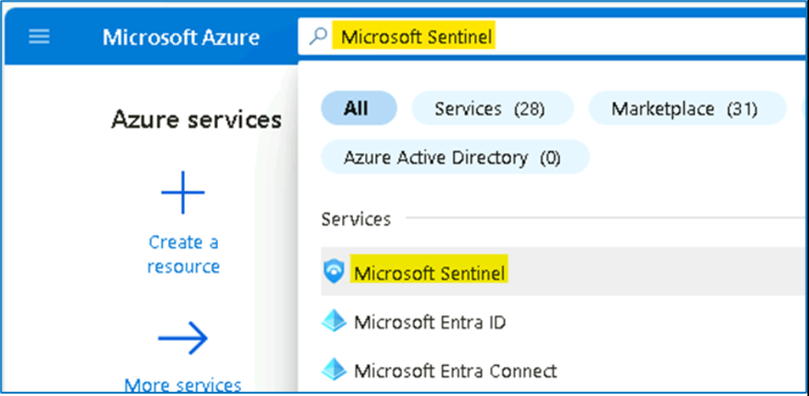
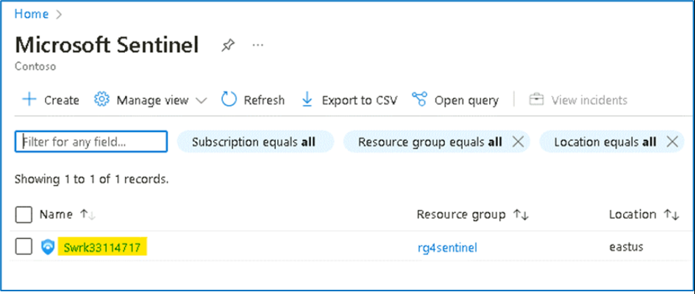
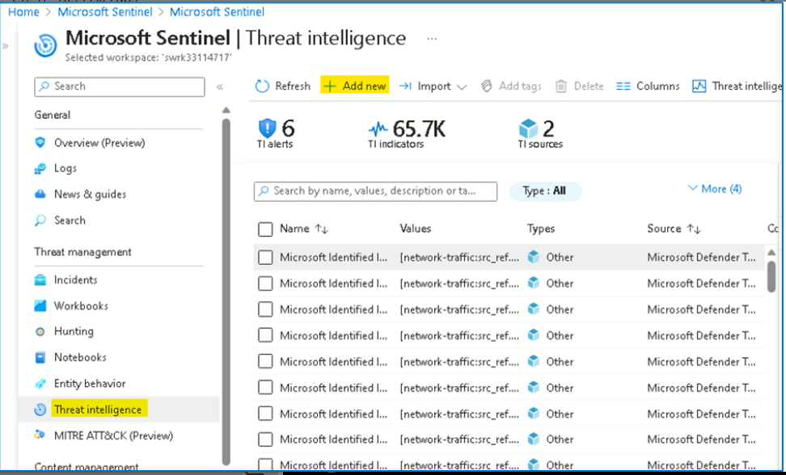
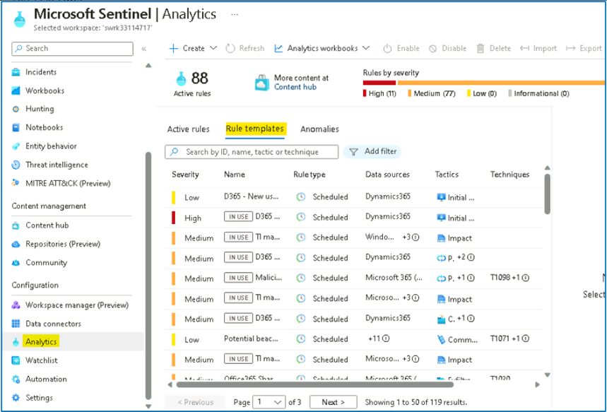

# Lab 5 - Threat Intelligence connector and Content hub

This Lab will demonstrate how to use Microsoft Sentinel Threat
Intelligence (TI) features and product integration points. During this
Lab we rely on TI data that we ingested in earlier labs, so please make
sure you have completed previous Labs. In this Lab we will also discover
how to visualize and use this data as part of investigation and
detection.

## Exercise 1 - Exploring the Microsoft Defender Threat Intelligence (Preview) connector

### Task 1 -- Enabling the Microsoft Defender Threat Intelligence (Preview) connector

This connector is currently in preview and ingests Microsoft Threat
Intelligence indicators automatically into the
ThreatIntelligenceIndicator table. MDTI provides a set of indicators and
access to the https://ti.defender.microsoft.com portal at no additional
cost, with the premium features of the MDTI portal and API requiring
licensing.

**Note** -- The **Microsoft Defender Threat Intelligence
(Preview)** connector was enabled in Lab 2 -- Task 2.

1.  On the Azure
    Portal [**http://portal.azure.com**](urn:gd:lg:a:send-vm-keys),
    search for [**Microsoft Sentinel**](urn:gd:lg:a:send-vm-keys) and
    click on **Microsoft Sentinel**.

2.  Select **SwrkXXXXXXX**.

3.  Click on **Data Connectors** under Configuration select **Microsoft
    Defender Threat Intelligence (Preview)**.

4.  On the bottom right pane click on **Open connector page**

5.  Review the data received and confirm that the connector is already
    ingesting indicators.

6.  Close the **Microsoft Defender Threat Intelligence
    (Preview)** Connector page, to return to the Microsoft Sentinel home
    page.

### Task 2: Review and manage TI IOC's in Microsoft Sentinel Threat intelligence menu

After we ingested our TI data into the ThreatIntelligenceIndicator
table, our mission is to review how our SOC can leverage and manage the
TI menu to allow us to search, tag and manage the lifecycle of IOCs.

1.  On the **Microsoft Sentinel** left menu click on the **Threat
    intelligence** under Threat management. This menu is a visual
    representation of the ThreatIntelligenceIndicator table. 

2.  Select one IOC from the main pane and notice that the right pane
    changed accordingly and present the metadata of the selected IOC.

3.  On the top area of the main blade, we can filter the list of the
    IOC's based on a specific parameters. In our case, we only ingested
    one type of IOC (IP), but the **Type** filter allow us to filter
    based on different types. If we ingested IOC's from multiple TI data
    sources, the **source** filter allows us to slice it.

### Task 3 - Review the TI data into Microsoft Sentinel Logs interface.

The ingested Indicators of Compromise (IOC) coming from any of these TI
feeds, is stored in a dedicated table
called **ThreatIntelligenceIndicator**, and visible on the Threat
Intelligence menu on the left navigation menu.

1.  On the left navigation click on **Logs**, this will redirect you to
    the Log Analytics query interface. On the query interface we can see
    on the left side the tables with the relevant fields.

2.  Microsoft Sentinel built-in tables have a predefined schema, to be
    able to see the **ThreatIntelligenceIndicator** schema, run the
    following query:

**[ThreatIntelligenceIndicato](urn:gd:lg:a:send-vm-keys)r**

[**| getschema**](urn:gd:lg:a:send-vm-keys)

3.  Let's explore and delve into the TI table. Run the following query
    which takes 10 records from the table:

[**ThreatIntelligenceIndicator**](urn:gd:lg:a:send-vm-keys)

[**| take 10**](urn:gd:lg:a:send-vm-keys)

4.  To understand if a specific IOC is active, we need to have a closer
    look at the following columns:

    - **ExpirationDateTime \[UTC\]**

    - **Acitve**

### Task 4 - Adding new TI IOC manually in Microsoft Sentinel Threat intelligence menu

Part of the SOC analyst's job is to manually add an IOC into the TI
index from time to time. This allows other data sources and detections
to correlate and detect interaction with this IOC.

1.  On the **Threat intelligence** top menu, click on **Add new**,

2.  On the **New indicator** dialog provide the below details and then
    click on **Apply** button

    - Types -- **url**

    - URL - [**http://phishing.com**](urn:gd:lg:a:send-vm-keys)

    - Tags - [**Incident 4326**](urn:gd:lg:a:send-vm-keys)

    - Thread types - [**malicious-activity**](urn:gd:lg:a:send-vm-keys)

    - Description -- [**this URL is found in Incident
      4326**](urn:gd:lg:a:send-vm-keys)

    - Name -- **url indicator**

    - Confidence level -- 80

    - Set the **Valid from** as today date

    - **Valid until** two weeks from today.

3.  Notice to the newly created IOC on the TI menu.

4.  Be aware that every new IOC added in the TI menu, will be
    automatically added to the ThreatIntelligenceIndicator table. You
    can validate it by opening the **Logs** menu and run the query
    below.

**Note** -- It can take about 5 mins to have the result shown.

[**ThreatIntelligenceIndicator**](urn:gd:lg:a:send-vm-keys)

[**| search "http://phishing.com"**](urn:gd:lg:a:send-vm-keys)

5.  Select the newly created manual IOC and press **Delete** button.

### Task 5 - Reviewing Analytics Rules based on Threat Intelligence data

1.  From the **Microsoft Sentinel** page, click on **Analytics** and
    then click on the **Rule Templates** tab.

2.  Click on **Add filter** and then select the **Data Sources** filter.

3.  Select **Microsoft Defender Threat Intelligence
    (Preview).** Click **Apply** to apply the filter.

4.  As you can see, there is a long list of resulting alert templates.
    These all will correlate your different data sources with the IOCs
    present in your TI table (**ThreatIntelligenceIndicator**), to
    detect any trace of malicious indicators of compromise in your
    organization's logs.

5.  As you may know, it is free to enable analytics rules in Microsoft
    Sentinel, so the best practice is to enable all the ones that apply
    to data sources that you are ingesting.

### Task 6 - Enabling Threat Intelligence Matching Analytics rule

1.  From the Microsoft Sentinel page, click on **Analytics** and click
    on **Rule Templates** tab. Clear previously applied filters if any.

2.  Click on Add filter and then choose **Rule Type** filter and
    select **Threat Intelligence**.

3.  The resulting rule template matches Microsoft-generated threat
    intelligence data with the logs you have ingested into Microsoft
    Sentinel. The alerts are very high fidelity and are turned ON by
    default. Visit this link for more information about this type of
    rule.

4.  Select the rule template and notice the different data sources that
    are supported (at the time of writing, these are CEF, Syslog and
    DNS). Click on **Create rule**.

5.  In the wizard, click on **Review and Create**.

6.  Click on the **Save** button to create the Rule

### Task 7 -- Explore and visualize Threat Intelligence workbook

1.  While still on the **Microsoft Sentinel** page, click
    on **Workbooks** under **Threat management** and then click on **Add
    workbook**.

2.  You will find some pre-built visualizations that show you the
    indicators imported into Sentinel over time, by type and provider.
    To modify or add a new chart, select the **Edit** button at the top
    of the page to enter editing mode for the workbook.

3.  Add a new chart of threat indicators by threat type. To do this,
    scroll to the very bottom of the page and select **Add** \> **Add
    Query**.

4.  Add the following text to the Log Analytics workspace Log Query text
    box and then click on the **Run Query** button.

[**ThreatIntelligenceIndicator**](urn:gd:lg:a:send-vm-keys)

[**| summarize count() by ThreatType**](urn:gd:lg:a:send-vm-keys)

5.  In the Visualization drop-down, select **Bar chart**.

6.  Select the **Done editing** button. You've created a new chart for
    your workbook.

7.  Click on the **Save** button and on the Workbook details tab,
    provide the Resource group details and then click on
    the **Apply** button.

## Exercise 2 -- Exploring the Microsoft Sentinel Content hub.

### Task 1 -- Overview of Microsoft Sentinel Content hub

1.  On the Azure
    Portal [**http://portal.azure.com**](urn:gd:lg:a:send-vm-keys),
    search for [**Microsoft Sentinel**](urn:gd:lg:a:send-vm-keys) and
    click on **Microsoft Sentinel**.

2.  Select **SwrkXXXXXXX**.

3.  Now click **Content hub** under **Content Management**.

4.  In the search bar, type [**Cloudflare**](urn:gd:lg:a:send-vm-keys).
    You will see a single result corresponding to Cloudflare solution.
    You could also search using the filtering options at the top.

5.  Select the Cloudflare solution. As you can see on the right pane,
    here we have information about this solution, like category,
    pricing, content types included, solution provider, version and also
    who supports it. Click **Install**.

6.  Click on the **Manage** button.

7.  Notice the different artifacts that are included in this
    solution: **Data Connector, Parser, Workbook, Analytics
    Rules** and **Hunting Queries**. Each Solution can contain a
    different set of artifacts.

8.  Close the **Cloudflare for Microsoft Sentinel** information page and
    you can navigate to other solutions. In the next exercise, we will
    install one of them.

### Task 2 - Deploying a new solution from Content hub

1.  From the Microsoft Sentinel portal, navigate to **Content
    hub** under **Content Management**

2.  In the search bar, type [**dynamics 365
    CE**](urn:gd:lg:a:send-vm-keys). Select on the **Dynamics 365 CE
    Apps** solution and click on **View Details**. Notice the content
    being added by this solution (Data Connector, Analytics Rules,
    Workbook, Hunting Queries and Watchlists).

3.  Click on **Create**.

4.  On the **Create Microsoft Sentinel Solution for Dynamics 365 CE Apps
    (Preview)** page provide the below details.

a\. Subscription -- **Azure Pass -- Sponsorship**

b\. Resource group -- **RG4Sentinel**

c\. Workspace -- **Swrk33114717**

5.  Click on **Next** and review the information on
    the **Workbooks** tab.

6.  Click on **Next:** and review the information on **Analytics** tab.

7.  Notice the different **Analytics Rules** that will be added to your
    workspace. Click **Next.**

8.  On the **Hunting Queries** tab, notice the Hunting Queries included
    in the solution. Click **Next: Review + create**.

9.  A final validation will run. If everything is ok, click
    on **Create** button. The deployment will kick off and finish in a
    few seconds.

### Task 3 - Reviewing and enabling deployed artifacts

1.  Navigate back to **Microsoft Sentinel** home page and click
    on **Analytics**, and select the **Rule Templates** tab.

2.  Type [**Dynamics**](urn:gd:lg:a:send-vm-keys) in the search box. You
    should see **16** different analytics rules that look at **Dynamics
    365 data**.

3.  Notice that these rules are available as **templates**. In a
    real-world environment, you would need to create them in order to
    use them.

4.  Navigate to **Workbooks** under Threat Management. Search
    for [**Dynamics**](urn:gd:lg:a:send-vm-keys) Like the analytics
    rules the workbook exists as a template. This should be empty unless
    you have enabled the Dynamics 365 connector.

5.  Navigate to **Hunting**, go to **Queries** tab and search
    for [**dynamics 365**](urn:gd:lg:a:send-vm-keys) You should see 2
    new queries that use data coming from Dynamics 365.

6.  Navigate to **Watchlist** under Configuration. Search
    for [**d365**](urn:gd:lg:a:send-vm-keys). Notice you have two new
    watchlists.

Congratulations, you have completed Lab 5!

** **
