# Lab 7 - Exploring Microsoft Sentinel Advanced Features

## Exercise 1: Getting started with Notebooks in Microsoft Sentinel

You are a Security Operations Analyst working at a company that
implemented Microsoft Sentinel. You need to explore the benefits of
threat hunting with Microsoft Sentinel Notebooks. You can use notebooks
to:

- Perform analytics that are not provided out-of-the box in Microsoft
  Sentinel, such as some Python machine learning features.

- Create data visualizations that are not provided out-of-the box in
  Microsoft Sentinel, such as custom timelines and process trees.

- Integrate data sources outside of Microsoft Sentinel, such as an
  on-premises data set.

### Task 1: Exploring Notebooks

In this task, you will explore using notebooks in Microsoft Sentinel.

1.  On the Azure
    Portal [**http://portal.azure.com**](urn:gd:lg:a:send-vm-keys) and
    search for [**Microsoft Sentinel**](urn:gd:lg:a:send-vm-keys) and
    click on **Microsoft Sentinel**.

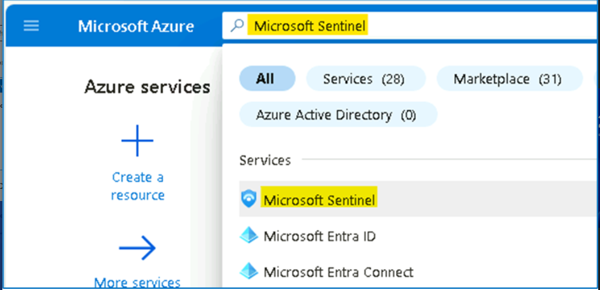

2.  Select **SwrkXXXXXXX**.

3.  Now click on **Notebooks** under the **Threat management** area.

4.  Next, you need to create an **AzureML** Workspace.
    Select **Configure Azure Machine Learning** and then select **Create
    new Azure ML workspace** button in the command bar.

5.  On the Azure Machine Learning page, provide the below details,

a\. Subscription - **Azure Pass-Sponsorship**.

b\. Resource group - **RG4Sentinel**

In the Workspace details section do the following:

c\. Name: [**AzureMLWorkspace**](urn:gd:lg:a:send-vm-keys) .

d\. Region -- **East US**

e\. Keep the default **Storage account**, **Key vault**,
and **Application insights** information.

f\. The **Container registry** option can remain as **None**.

6.  At the bottom of the page, select **Review + create**.

7.  Once the Validation is completed, click on **Create**

**Note:** It may take a few minutes to deploy the Machine Learning
workspace.

8.  Once the deployment is completed, navigate to the Microsoft Sentinel
    home page.

9.  Once the deployment is completed, open the Microsoft Sentinel
    Workspace, select **Notebooks** then click on the dropdown
    for **Configure Azure Machine Learning** and select **Set default
    Azure ML workspace.**

10. Under **Azure Machine Learning Workspace**,
    select **AzureMLWorkspace** and click **OK**.

**Note** -- If the **AzureMLWorkspace** is not visible in the drop-down
menu, then refresh the page and try again.

11. Select **Notebooks** again and then select the **Templates** tab
    from the middle command bar. And select **A Getting Started Guide
    for Microsoft Sentinel ML Notebooks**.

12. On the right pane, scroll down and select **Create from
    template** button.

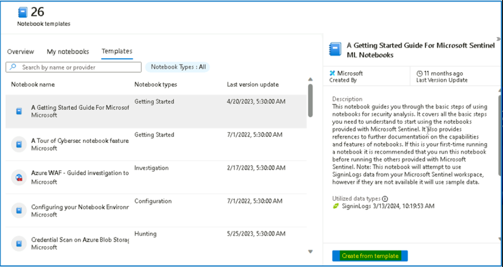

13. Review the default options and then select **Save**.

14. Once the saving is done, select the **Launch notebook** button. This
    will take you to the Microsoft Azure Machine Learning Studio.

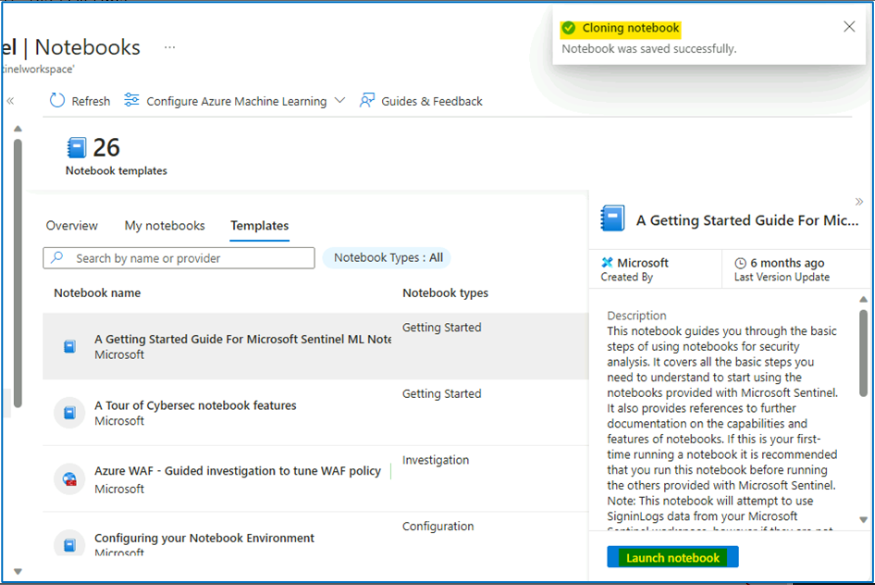

Note: You can also launch the workspace
from **Notebooks** \> **Configure Azure Machine Learning** \> **Navigate
to default Azure ML workspace.**

15. Click on the **All Workspaces** from the left menu, and then click
    on the **AzureMLWorkspace**.

16. Press the **Cancel** button, for the survey questions and then click
    on **Notebooks** under Authoring.

17. Select **Close** if an informational window appears in the Microsoft
    Azure Machine Learning Studio.

18. Click on Create compute button on the bottom right side of the
    screen.

19. Provide the compute name
    as [**SenComXXXXXX**](urn:gd:lg:a:send-vm-keys) \[Substitute XXXXXX
    with random to make the Compute name unique. This will identify you
    compute instance.

20. Scroll down and select Workload type: **Development on Notebooks and
    light weight testing** then click on **Review + Create** button.

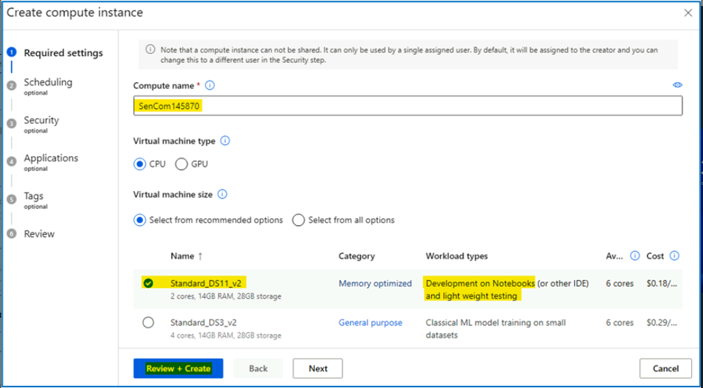

21. Select the **Create** button at the bottom of the screen.

22. Close any feedback window that may appear. This will take a few
    minutes, you will see a notification (bell icon) when it is done and
    the *Compute instance* left icon turns from blue to green.

23. You should get the notification as shown in the below image after
    1-2 minutes.

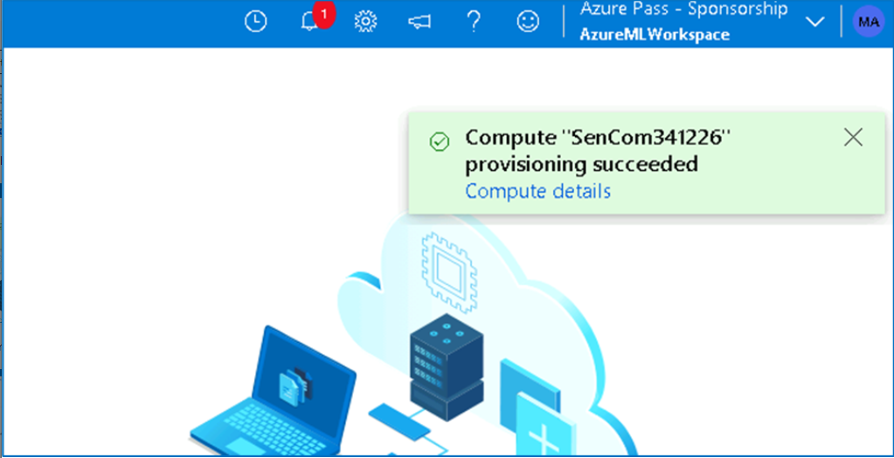

24. Click on the Terminal button after the Provision succeeded
    notification has appeared.

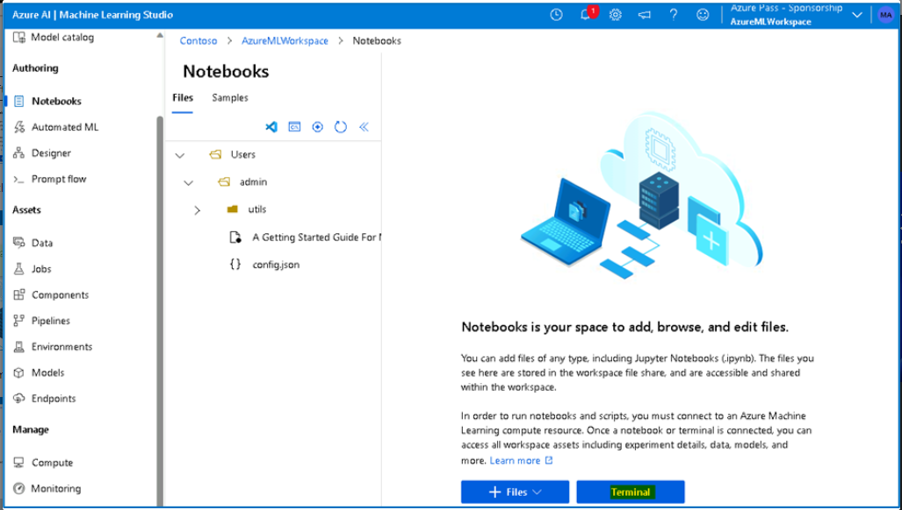

25. If the Terminal is launched correctly then no error should appear.

26. You have successfully created an Azure ML Compute resource.

27. From the terminal you can try the [**az
    login**](urn:gd:lg:a:send-vm-keys) command and authenticate to login
    as shown below

# Exercise 2: Getting started with Workbooks in Microsoft Sentinel

### Task 1: Exploring workbook templates

1.  On the Azure
    Portal [**http://portal.azure.com**](urn:gd:lg:a:send-vm-keys) and
    search for **Microsoft Sentinel** and click on **Microsoft
    Sentinel**.

2.  Select **SwrkXXXXXXX**.

3.  Now click on **Workbooks** under the **Threat Management** left
    blade and select the **Templates** tab.

4.  From the list select the **Azure Activity** template and
    click **View Template** button.

5.  Review the contents of the workbook. It usually shows insights of
    your Azure subscription operations by collecting and analyzing the
    data from the Activity Log.

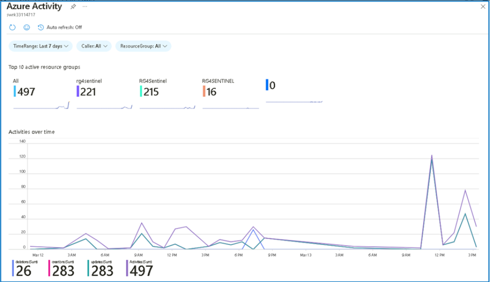

**Note**: If the log does not show any alert then follow the below steps
to turn on Azure activity log.

1.  Navigate to Sentinel.

2.  Search Data connectors under Configuration.

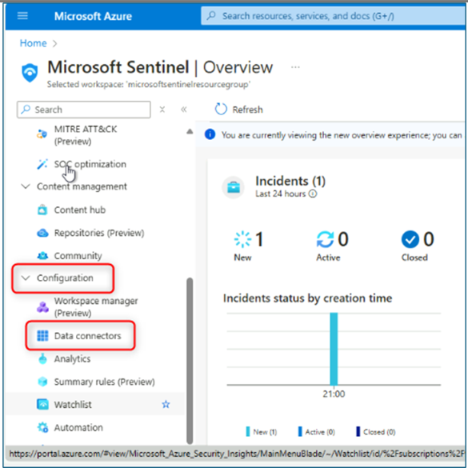

3.  Under Data connectors click on Azure Activity

4.  Click on Open connectors page.

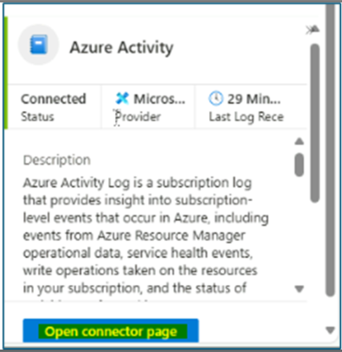

5.  On the next page, click on Launch Azure Policy Assignment Wizard.

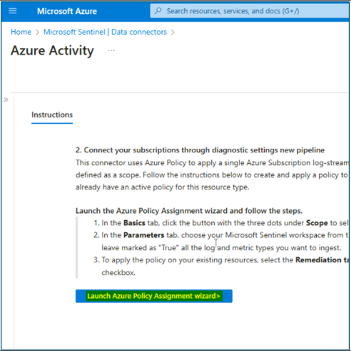

6.  Under basics tab select Scope, on the scope blade select Azure
    subscription.

7.  Under the Parameters tab select the Sentinel workspace that we
    created.

8.  Under Remediation tab click on Create Remediation task, and click on
    Review + create.

9.  Click on create.

10. Close the workbook by selecting the **X** in the top-right corner.

### Task 2: Save and modifying a workbook template

In this task, you will save a workbook template and modify it.

1.  While in the **Workbooks,** on the **Templates** tab, click
    the **Save** button for the **Azure Activity** workbook.

2.  Leave **East US** as the default value for *Region* and
    select **OK**.

3.  Select the **View saved workbook** button.

4.  Select **Edit** in the command bar to enable changes in the
    workbook.

5.  Scroll down to the **Caller activities**. Select the **Edit** button
    below the grid.

6.  You can follow the next steps if there is data from the KQL query.  
    Select the **Column Settings** button, it is located to the right of
    the\*\* Run Query \*\*command bar.

7.  In the **Edit column settings** blade that appears
    within Columns select Activities.

8.  Change the value for **Column renderer** to **Heatmap**. For **Color
    palette**, scroll down to select **32-color categorical**.

9.  Select **Save and Close**. Notice the change in
    the *Activities* column.

10. Click on **Done Editing**

11. Close the workbook by selecting the **X** in the top-right corner.

12. Close the Azure Activity workbook blade.

### Task 3: Creating a Workbook

In this task, we will create a new workbook with advanced
visualizations.

1.  While still on the **Workbooks** area of the Microsoft Sentinel
    portal.

2.  Select **+ Add workbook** to create a new workbook from scratch.

**Note:** Although it is a new workbook, a startup template is used.

3.  To edit the workbook, select **Edit**.

4.  Select the **Edit** button below the first paragraph of the
    workbook.

5.  Type [**\# My workbook**](urn:gd:lg:a:send-vm-keys) in a new line on
    top of **\## New workbook**.

6.  Select **Done Editing** on the bottom of this section, **Editing
    text item: text -** **2**.

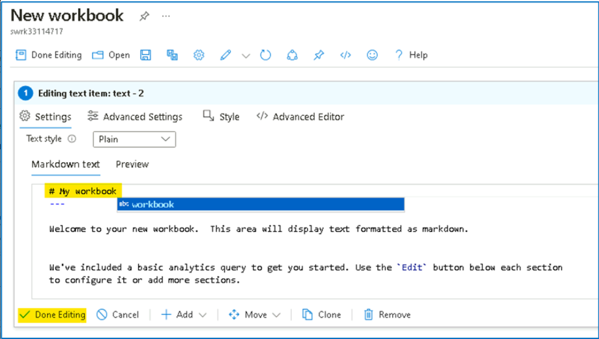

7.  Notice that your header increased size and name changed.

8.  Click on **Edit** again and then select **Edit** below the only
    visible barchart graph.

9.  Review the KQL statement that provides a *union* statement of counts
    across all tables. Scroll down and select the **Done Editing** on
    the bottom menu, for the **Editing query item: query - 2**.

10. Select the ellipsis **...** next to the **Edit** button of the
    barchart graph, then select **+ Add**, then select **Add query**.

11. Type **SecurityEvent** into the query box. Change the **Time
    Range** to **Last hour**. Change the **Visualization** to **Time
    chart**.

12. Select **Style** tab from the query's command bar. Select the **Make
    this item a custom width** box. Set the **Percent
    width** to **25** and **Maximum width** to **25**.

13. Now select **Advanced Settings** tab from the query's command bar.
    Select **Show refresh icon when not editing** box. Scroll down and
    select **Done Editing** on the bottom menu, for the new **Editing
    query item: query - 2**.

14. Scroll down and at the bottom of the workbook select **+ Add**,
    then **Add query**.

15. Type [**SecurityEvent**](urn:gd:lg:a:send-vm-keys) into the query
    box. Change the **Time Range** to **Last hour**. Change
    the **Visualization** to **Grid**.

16. Select **Style** from the query's command bar. Select **Make this
    item a custom width** box. Set the **Percent
    width** to **75** and **Maximum width** to **75**. Scroll down and
    select **Done Editing** on the bottom menu, for the new **Editing
    query item: query - 3**.

17. If required, click on **Done Editing** in Workbook's top command
    bar.

18. Select the **Save** icon, change the **Title** to [**My
    Workbook**](urn:gd:lg:a:send-vm-keys).

19. Select the **RG4Sentinel** resource group if needed and leave other
    values as default. Select **Apply** to commit the changes.

20. Close the workbook by selecting the **X** at the top-right or
    select **Workbooks** in the Microsoft Sentinel portal.

21. Back in the **Workbooks** page, you should be able to see **My
    workbooks**.

22. Select the workbook you just created, **My workbook**. On the right
    pane, select **View saved workbook** to review your workbook.

**Congratulation,** you have completed **Lab 7**
